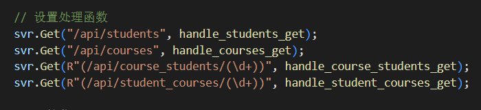
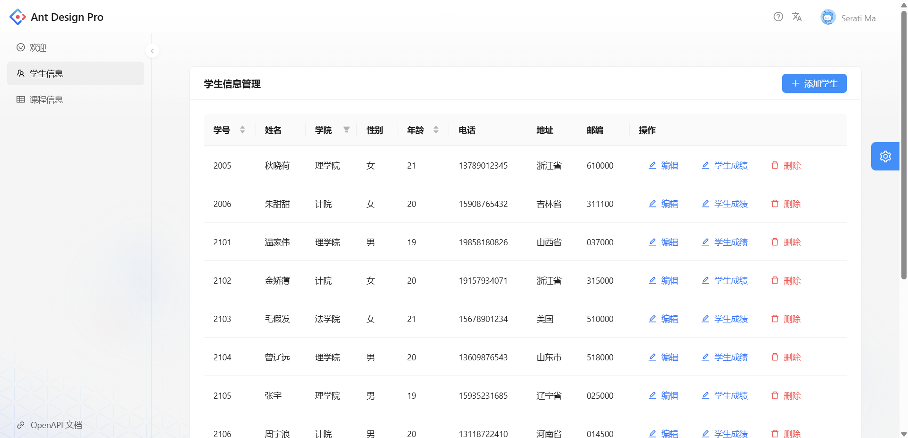
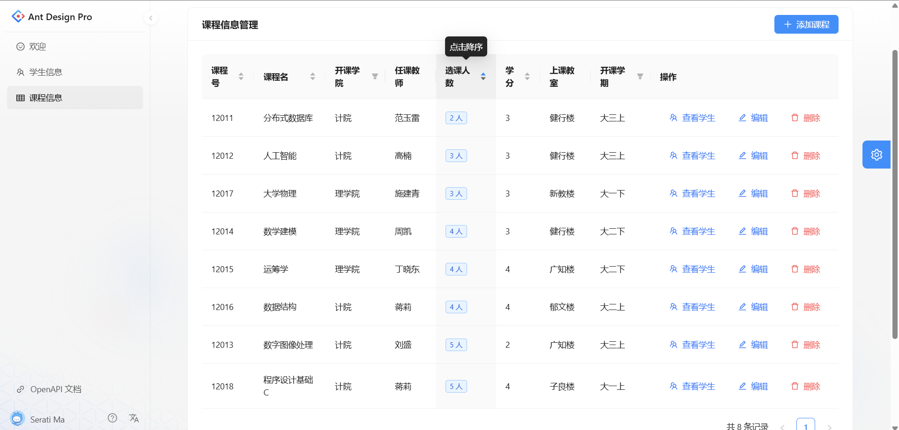
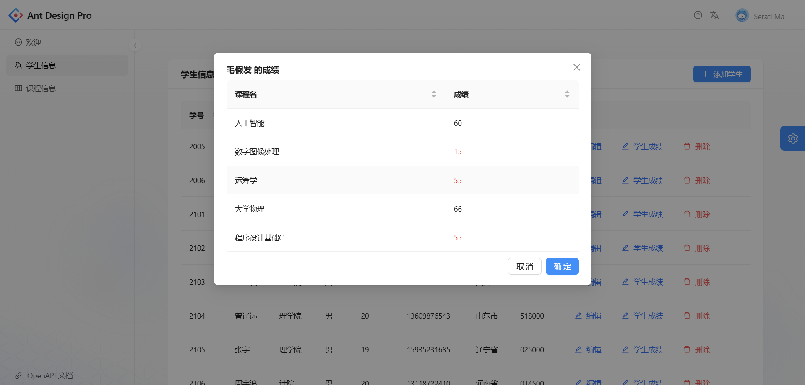
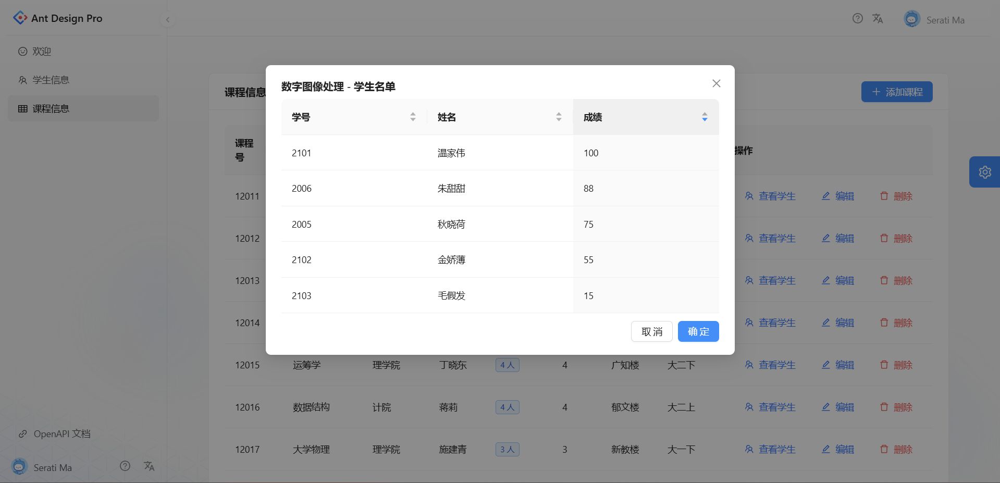
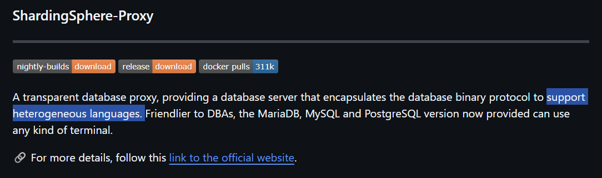
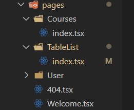
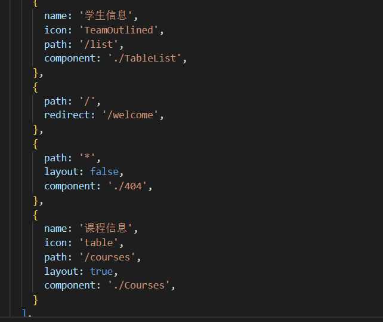

# 分布式数据库课设demo

周末不上班😊，闲着写了个demo📢

## 技术栈

- 前端：React

  Antd Pro of React

  Ant Design

- 后端：C++

  httplib 网络库

  mysql c api 连接数据库

## 已完成功能

### 数据库

C语言连接 mysql，用了之前实验的数据库 sql 数据

### 前端

前端完成了学生和课程页面的**查**功能

分别对应下面四个 api：

从上到下依次为：

1. 获取所有学生信息

   

2. 获取所有课程信息

   

3. 根据学号检索相关选课课程信息

   

4. 根据课程号检索选课学生信息

   

## 未完成功能

- shardingsphere 分库分表

  - 搭建

    [我同学的博客](https://blog.csdn.net/C137DAWN/article/details/134978190?csdn_share_tail=%7B%22type%22%3A%22blog%22%2C%22rType%22%3A%22article%22%2C%22rId%22%3A%22134978190%22%2C%22source%22%3A%22C137DAWN%22%7D)

  - 连接

    据官网说 shardingsphere proxy 是和语言无关的，而且他也支持 Mysql 协议，我想应该不用 Java 也能连上逻辑数据库吧

    

- 学生界面和课程界面的**增删改**功能

- user 表

  选课系统大致应分为**管理员、老师、学生**三种角色，不同权限下渲染的界面不同

- 其他没想到的点

  todo

## 简易教程

### 后端

- 开发环境：VSCode

- 开发语言：C/C++

- 编译器：mingw

- 第三方库：

  - 网络库：httplib
  - mysql c api

- 响应数据格式：json

  没有配置 json 库，为了配置环境简便，我直接手动构造 json

### 前端

前端主要参考[Ant Design Pro入门教程](https://www.cnblogs.com/7tiny/p/13444963.html)

我修改了 Page 页面

config.ts

### 启动！

https://github.com/user-attachments/assets/a8d853a1-91cb-4e53-9e89-140a94940f5a

> TIP
>
> 前后端分离：此 demo 前后端分离，通过 api 发送和接收请求
>
> 其他方案：C++ 并不适合写 web 项目，而且我后端的代码全部放在了一个文件里，非常不便于管理，**更合适的有** JAVA SSM 或 python 的 flask 等

